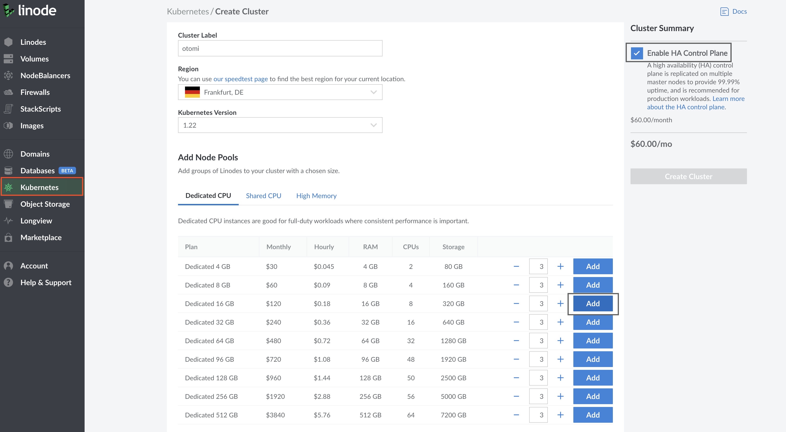
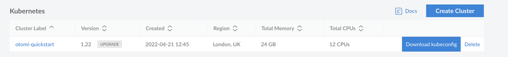

# Getting started with Otomi on Linode

## Prerequisites

- [linode-access](https://cloud.linode.com/)

## Configure Linode Kubernetes cluster

Configure the LKE cluster with the following specs

- K8s version: 1.22
- Dedicated CPU: Dedicated 8 GB Plan, 4 CPUs, 320 GB Storage
- Enable HA Control Plane



Download the `kubeconfig` as seen in the picture below



```bash
# Update the KUBECONFIG env to gain access to the cluster
export KUBECONFIG=<path-to-downloads>/otomi-quickstart-kubeconfig.yaml
```

## Install Otomi using helm

```bash
# Add the Otomi repo
helm repo add otomi https://otomi.io/otomi-core
helm repo update
# Otomi install with minimal chart values
helm install otomi otomi/otomi --set cluster.name=otomi-quickstart --set cluster.provider=custom
```

The helm chart deploys an installer job responsible for installing Otomi on the GKE cluster.

```bash
# Monitor the job status
kubectl get job otomi -w
# Installer job logs
kubectl logs jobs/otomi -n default -f
```

At the end of the logs of the installer job, you will find the `URL` and the `credentials` to log into the Otomi console.

Now follow the activation instructions [here.](https://otomi.io/docs/get-started/activation)
